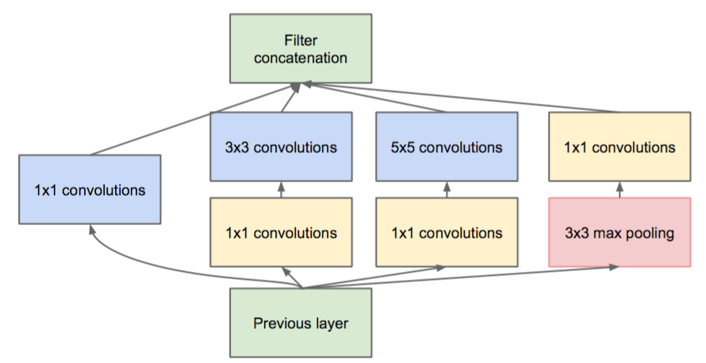
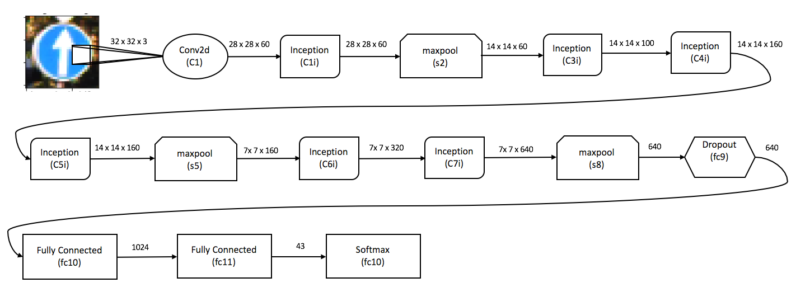

This lab was completed for Udacity's nano-degree program for Self-Driving Vehicle (Semester 1) 

## GTInception
For this lab I implemented the *Inception* topology based on the idea shown [here](https://arxiv.org/pdf/1409.4842.pdf). 

This implementation (which I codenamed GTInception) is shallower than GoogLeNet, and consequently trains much faster than it. On Amazon's AWS with 1 GPU it took less than 4 hours for 100 epochs with a batch size of 150. 

GTInception's performance on the German traffic data set [INI](http://benchmark.ini.rub.de/) achieves an accuracy of 0.953 and F1 score of 0.907 (compared to Google's net accuracy of 0.9957, which was trained for much much longer on a broader dataset)

### LeNet
Performance of LeNet-5 implementation is also shown (in the notebook) as a baseline. Here LeNet-5 was also trained for 100 epochs and batch size of 150. 

# Files
* TrafficSignClassifier_MainNotebook.ipynb : The complete implementation
* Report.ipynb : self - explanatory

# CarND-LeNet-Lab

### Dependencies
This lab requires:

* [CarND Term1 Starter Kit](https://github.com/udacity/CarND-Term1-Starter-Kit)

The lab enviroment can be created with CarND Term1 Starter Kit. Click [here](https://github.com/udacity/CarND-Term1-Starter-Kit/blob/master/README.md) for the details.
